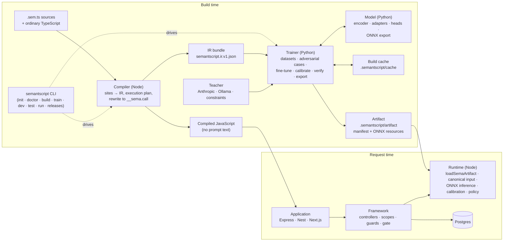

# Architecture overview

SemantScript is six parts in two languages, joined by data rather than
imports: the compiler writes an IR bundle the trainer reads, and the trainer
writes an artifact the runtime loads. Everything a language model does
happens at build time; at request time there is a tokenizer, an encoder, an
adapter and a head in ONNX Runtime.

## The parts

| Part      | Package                   | Language | Owns                                                                                                                                                                                                                                                        |
| --------- | ------------------------- | -------- | ----------------------------------------------------------------------------------------------------------------------------------------------------------------------------------------------------------------------------------------------------------- |
| Compiler  | `@semantscript/compiler`  | Node     | Finding `sema` sites, resolving inputs and outputs to IR types, lowering examples and constraints, the execution plan (dependencies, stages, domains), rewriting sites, emitting the bundle; the tsc, esbuild, Vite and loader adapters; the editor plugin. |
| Trainer   | `semantscript_trainer`    | Python   | Synthetic and adversarial datasets through a teacher, joint training over one shared encoder, temperature calibration, verification gates, verified IR, artifact export, the build cache, the bundle driver `train` runs.                                   |
| Model     | `semantscript_model`      | Python   | The encoder (a Hugging Face checkpoint, optionally cut to a prefix depth), per-domain adapters, per-function heads, the proper-scoring loss, ONNX export with parity checks.                                                                                |
| Runtime   | `@semantscript/core`      | Node     | The public `sema` declarations, artifact loading and verification, canonical input serialization, inference in a worker over ONNX Runtime, calibration, confidence policy and fallbacks, stages and request scopes.                                         |
| CLI       | `semantscript`            | Node     | One entry point over the four above with zero-config defaults; `doctor` checks the environment first; `dev` for the watch loop.                                                                                                                             |
| Framework | `@semantscript/framework` | Node     | Decorated controllers, one request scope per handler, `require` guards, Express/Nest mounting, Next.js handlers, transactions gated by decisions.                                                                                                           |

## Build time, step by step

1. The compiler plans the whole TypeScript program: every `sema` site's
   output type becomes a head description (support, nominal or ordinal), every
   interpolated input a typed descriptor, the options object examples and a
   constraint AST. Provenance analysis records which expressions feed which,
   and the plan groups expressions into stages and, when routed, domains.
2. Emission replaces each site with `__sema.call(id, { inputs })`, where the
   id is a digest of the expression's semantic identity, and writes the IR
   bundle last, atomically.
3. The trainer reads the bundle. For each expression it obtains a corpus
   (gold examples, teacher-generated cases, boundary pairs and counterfactual
   twins around the constraints), all cached by content. The build cache then
   decides what to train: nothing for unchanged expressions, a head for a
   changed one, everything jointly for a recipe change or `--full`.
4. Training fine-tunes the application's encoder (or its prefix per domain)
   with one adapter per domain and one head per expression, summing losses.
   Verification fits a temperature per head on the held-out split and gates
   on gold example misses, constraint violations, type errors and ECE; a
   function that fails is not published.
5. Export writes ONNX graphs (encoder or prefix, adapters, heads), the
   tokenizer and a manifest into a release directory named by the manifest's
   digest, and flips the artifact pointer atomically.

## Request time, step by step

1. `loadSemaArtifact()` finds the artifact, re-hashes every resource, checks
   the model ABI and the encoder-adapter-head chain, and activates it; with
   `watch: true` it swaps in later releases without a restart.
2. A compiled call serializes its inputs canonically (the same text the
   trainer saw), and the worker runs tokenizer, encoder, adapter and head.
   Calibrated probabilities go through the function's confidence policy;
   the value comes back synchronously.
3. Inside a request scope (the framework opens one per handler), calls over
   identical inputs share the encoder and adapter passes; `callStage` and
   `executeSemaPlan` do the same explicitly for a plan's stages.

## Contracts

- **Source to IR**: `SPEC.md` (the language) and the compiler's diagnostics.
- **IR to artifact**: `IR.md` and the JSON Schemas under `schemas/`
  (`neural-function.v1`, `ir-bundle.v1`, `application-artifact.v1`,
  `artifact-pointer.v1`). The [IR and artifact reference](ir-and-artifact-reference.md)
  explains them.
- **Identity**: a function's id and semantic digest cover template, inputs,
  output, examples, constraints and runtime policy; routing, the plan,
  training and verification are outside it, so retraining changes behavior
  without changing identity.
- **Never**: prompt text in emitted JavaScript or an artifact; a database
  client as an input; a value outside the declared support.
